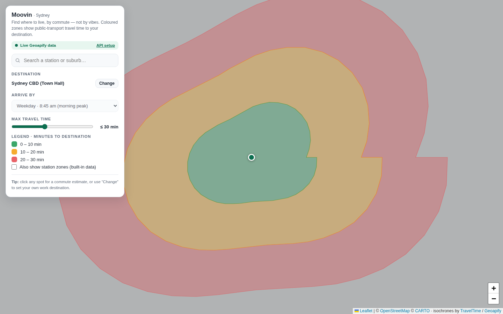

# Moovin

Find where to live, by commute — not by vibes.

Moovin is a Google-Maps-style site that draws coloured travel-time bands (like isochrones) around a destination — currently Sydney CBD by default, or any point you pick — showing how far you can live away and still keep your public-transport commute under a time budget you choose.



## Why

Built while house-hunting for a move to Sydney: existing suburb/rent tools show distance, not actual public-transport travel time. A suburb 5 km from the city can be a 12-minute express-train ride or a 40-minute two-bus slog — Moovin tries to show that difference on a map instead of a spreadsheet.

## Features

- **Live travel-time isochrones** from [TravelTime](https://traveltime.com/) or [Geoapify](https://www.geoapify.com/) — real computed shapes, not simple circles, that hug the transit network and leave gaps where a spot genuinely isn't well served.
- **Custom destination** — click "Change" or use a station popup's "Set as destination" to recolour the whole map relative to any point (your future office, a friend's place, etc.), not just the CBD.
- **Arrive-by time picker** — morning peak, off-peak, evening peak, Saturday. TravelTime only: it reads real timetables, whereas Geoapify's transit shapes don't vary by time of day (the picker greys out on Geoapify).
- **Search** for any of ~195 built-in Sydney train/metro/light rail/ferry/bus stops.
- **Click anywhere** on the map for an instant commute estimate.
- **Saved spots** — bookmark candidate suburbs from any popup and compare them side by side, sorted best-commute-first. Change the destination and every saved spot re-scores against it. Stored in your browser only (`localStorage`) — no account, no server, nothing leaves the device.
- **Rent overlay** — a price marker per suburb, colour-coded cheap→dear, with a filter panel for weekly budget, bedrooms and property type. The filter that matters is "only inside my travel-time bands": it answers *where can I afford to live that's still within my commute*, which is the whole point of the site. Click any marker for the breakdown by bedrooms and dwelling type. Real figures from NSW bond lodgements, bundled in the page — no key needed. See [Rent data](#rent-data).
- **Shareable links** — "Copy shareable link" bakes the destination, time budget and arrival time into the URL, so sending someone a link reopens exactly what you were looking at. The address bar tracks your changes as you go.
- **Two-tier caching** — computed bands are cached for the session and mirrored into `localStorage`, so revisiting a destination (or just reloading) costs no API quota for a week.
- **Automatic fallback** — if no API key is connected (or a request fails), the site falls back to a built-in approximate dataset (hand-compiled off-peak timetable estimates) so it's never blank.
- **Optional shared-key proxy** (`worker/`) — a small Cloudflare Worker that keeps the provider key server-side and caches aggressively, so visitors get live bands without needing a key of their own. See [Deploying](#optional-serve-visitors-from-your-own-key-worker).

## Providers

Two work, and you only need one:

| | Accuracy | Signup | Free tier |
|---|---|---|---|
| **TravelTime** | Timetable-exact, varies by arrival time | Asks for a business name — your own name or project name generally works | Tighter — every page load spends from it |
| **Geoapify** | Transit shapes partly modelled, same at any hour | Email only, no card | ~3,000 credits/day |

If both are present in `config.js`, **TravelTime is used** — it's the accurate one. Geoapify is the fallback. If a deployed proxy is configured (see [Deploying](#optional-serve-visitors-from-your-own-key-worker)) it overrides both, since it needs no key from the visitor at all. With neither key, the site runs on built-in approximate data.

Precedence lives in `app.js` near the top, if you'd rather flip it.

## Quick start

1. Clone this repo.
2. Get a key from whichever provider suits you:
   - **TravelTime** (recommended) — [account.traveltime.com/signup](https://account.traveltime.com/signup), gives you an Application ID *and* an API key.
   - **Geoapify** — [myprojects.geoapify.com](https://myprojects.geoapify.com/), a single key, easiest signup.
3. Copy the config template and paste your credentials in:
   ```
   cp config.example.js config.js
   ```
   then edit `config.js` — fill in the provider you signed up for and leave the other blank:
   ```js
   const MOOVIN_CONFIG = {
     travelTimeAppId: "your-app-id",
     travelTimeApiKey: "your-api-key",
     geoapifyKey: "",
   };
   ```
4. Open `index.html` in a browser. If your browser blocks `fetch` requests from a plain `file://` page, serve the folder locally instead:
   ```
   python3 -m http.server 8000
   ```
   then visit `http://localhost:8000`.

No `config.js`? The site still works — it uses the built-in approximate data, and you can paste a key into the in-app **API setup** panel for that browser tab instead (not saved between sessions).

## Deploying

This is a static site — `index.html`, `styles.css`, `app.js`, `stations.js`, `rentdata.js`, plus your local `config.js`. GitHub Pages, Netlify, Vercel, or any static host all work with zero build step.

Note: `config.js` is gitignored on purpose, so a public deployment won't have your key baked in — visitors would need to add their own via the API setup panel. That's intentional; don't commit a real API key to a public repo.

### Optional: serve visitors from your own key (`worker/`)

If you'd rather visitors didn't need a key at all, deploy the Cloudflare Worker in `worker/`. It holds the provider key server-side and the browser only ever talks to your endpoint.

**The Worker speaks Geoapify only.** Routing TravelTime through it would mean adding a second upstream path — a different request shape (`POST` with a JSON body and an arrival time, rather than a `GET`). So with the proxy enabled, visitors get Geoapify bands and the arrival-time picker greys out, even if your own `config.js` uses TravelTime.

A key can't be hidden in a static page, so this is the only way to do it — but it also means you're paying for everyone's lookups. The Worker is built around that: it snaps incoming coordinates to a ~300 m grid before they become a cache key, so nearby lookups collapse onto one stored response, and since most people are asking about the same handful of destinations, most requests never reach Geoapify. It also restricts requests to a Sydney bounding box and rate-limits cache misses only.

```
cd worker
npx wrangler login
npx wrangler kv namespace create ISO_CACHE   # paste the printed id into wrangler.toml
npx wrangler secret put GEOAPIFY_KEY         # your key, stored server-side
# set ALLOWED_ORIGINS in wrangler.toml to your site's origin
npx wrangler deploy
```

Then put the deployed URL into `DEFAULT_API_BASE` near the top of `app.js`:

```js
const DEFAULT_API_BASE = "https://moovin-api.you.workers.dev";
```

That value is public by design, so unlike the API keys it belongs in the committed file. With it set, the site boots straight into live data, the status chip reads "Live data · shared key", and the API setup panel becomes optional — visitors who hit the shared rate limit can still paste their own key, or switch back with "Use shared key".

To run the Worker locally, put `GEOAPIFY_KEY=…` in `worker/.dev.vars` (gitignored), run `npx wrangler dev`, and set `apiBase` in your `config.js` to the address it prints.

Worth knowing: Cloudflare's rate-limit binding is not enforced by `wrangler dev` — it always reports success locally and only takes effect once deployed. Everything else behaves the same in both.

## Rent data

**The rent overlay shows real rents, out of the box, with no key.** They come from [NSW Fair Trading's rental bond data](https://www.nsw.gov.au/housing-and-construction/rental-forms-surveys-and-data/rental-bond-data): every residential bond lodged in NSW is recorded, and the per-bond rows are published monthly as open data under CC BY.

Two things make this the right default. It needs nothing — no key, no signup, no proxy, no quota — because the figures ship in the page as `rentdata.js`, the same way `stations.js` does. And it is what tenants *actually agreed to pay* at the start of a tenancy, not what a listing was advertised at, which is the number you want when working out whether you can afford a suburb.

The bundled file covers **478 NSW postcodes from 290,710 bonds** over a rolling 12 months. Each postcode carries a median weekly rent by bedroom count, by dwelling type, and by the two crossed — so "2-bed apartment" is a real median over 2-bed apartments, not a guess stitched together from the other two.

### Refreshing it

Fair Trading publishes a new month roughly mid-month. To pull the latest:

```
pip install openpyxl
python tools/build-rent-data.py
```

That scrapes the source page for the newest 12 monthly spreadsheets, aggregates them, and rewrites `rentdata.js`. Downloads are cached under `tools/.cache` (gitignored), so re-runs only fetch what's new. Never edit `rentdata.js` by hand — it's generated.

### What the numbers do and don't tell you

- **They're bonds, not listings.** A bond is lodged when a tenancy starts, so the data lags the market by however long leases run, and it says nothing about what's available right now.
- **A rolling 12-month window** evens out seasonality and gives thin postcodes enough observations to be worth reporting, at the cost of blurring a fast-moving market.
- **Sparse cells are hidden, not filled in.** A postcode needs 25 bonds to appear at all, and any single median needs 8 behind it. Only 65 of the 478 postcodes have enough studio bonds to report one, so filtering to Studio genuinely empties most of the map — that's the data being honest rather than a broken filter.
- **Postcodes aren't suburbs.** Markers sit at the postcode centroid and are labelled with its principal locality, so 2042 reads "Enmore" though it covers Newtown too. The postcode is always shown next to the name.
- **Garages, car spaces and rented rooms are excluded** (Fair Trading's "other" and "unknown" dwelling types), so they can't drag a bedroom median down.

### Optional: Domain listings instead

If you want asking prices from live listings rather than agreed rents from bonds, put a Domain API key in `config.js`:

```js
domainApiKey: "your-key-here",
```

Free "innovation" tier at [developer.domain.com.au](https://developer.domain.com.au/). When the key is present the overlay uses it in preference to the bond data, fetching per viewport and grouping listings per postcode into medians.

Worth knowing before you bother: the key authenticates and Domain does send permissive CORS headers, so the browser-direct call works and doesn't need the `worker/` proxy. But residential listing search is a *Production*-environment operation, and projects are provisioned Sandbox-only by default — so a fresh innovation-tier key gets you a 403 until you add the Production variant of the Agents & Listings package. The free tier is also small enough that a busy public deployment would exhaust it.

If the Domain call fails for any reason, the overlay drops back to the bundled bond data and says so, rather than going blank.

### Sample data

`rentals.js` still carries a small set of invented figures for ~50 Sydney postcodes. They're the last-resort fallback if `rentdata.js` is missing entirely, and they're labelled as sample data everywhere they appear — the panel and every popup. Nothing should be read into them.

## How the data works

- **Isochrones**: on connect, the site asks the active provider for one shape per band threshold (10/20/30… min) around your destination.
  - *TravelTime* takes a single `POST` to its `time-map` endpoint carrying all bands at once, plus the arrival time from the "Arrive by" picker — so the shapes reflect the actual timetable at that hour.
  - *Geoapify* takes one `GET` per request to its isoline endpoint, asking for `transit` mode first and falling back to `approximated_transit` where exact transit coverage isn't available. It has no notion of arrival time.

  Either way the returned shapes are simplified (near-duplicate points dropped) before rendering, for smoother pan/zoom, and results are cached in memory per destination + bands + arrival time.
- **Built-in station data** (`stations.js`): ~195 Sydney PT stops with hand-compiled off-peak minutes-to-CBD, used as the no-API-key fallback and for the search/click-estimate features. These are estimates, not live timetable data — good for a first pass, not a substitute for checking an actual trip planner before signing a lease.
- **Saved spots**: kept under the `moovin.saved.v1` key in `localStorage` as `{v:1, spots:[{id, label, lat, lon}]}`. Times shown next to each spot are always derived on the fly from the built-in dataset relative to the current destination — nothing time-related is cached, so changing destination re-scores the whole list. The record shape is deliberately flat so a future server-backed version can sync the array as-is.

## Roadmap

- [x] Real computed travel-time bands (API-backed isochrones)
- [x] Custom destination, not just the CBD
- [x] Saved spots (per-browser)
- [ ] Saved spots synced across devices — needs accounts + a backend
- [ ] Per-mode filtering (train-only / bus-only) — unblocked now that TravelTime is wired up: it separates transit modes, where Geoapify's are combined
- [x] Rent/price overlay per suburb — real NSW bond data, no key required (see [Rent data](#rent-data))
- [ ] Rent data beyond NSW — every other state runs its own bond board with its own format; NT has none at all
- [ ] Any-city support (currently Sydney-only)
- [ ] Exact timetable data via [Transport for NSW GTFS open data](https://opendata.transport.nsw.gov.au/)

## Credits

- Map tiles: [CARTO](https://carto.com/) / [OpenStreetMap](https://www.openstreetmap.org/copyright) contributors
- Map library: [Leaflet](https://leafletjs.com/)
- Isochrones: [TravelTime](https://traveltime.com/) or [Geoapify](https://www.geoapify.com/)
- Rent data: [NSW Fair Trading](https://www.nsw.gov.au/housing-and-construction/rental-forms-surveys-and-data/rental-bond-data) rental bond lodgements, CC BY 4.0
- Postcode centroids: [australianpostcodes](https://github.com/matthewproctor/australianpostcodes)

## License

MIT — see [LICENSE](LICENSE).
